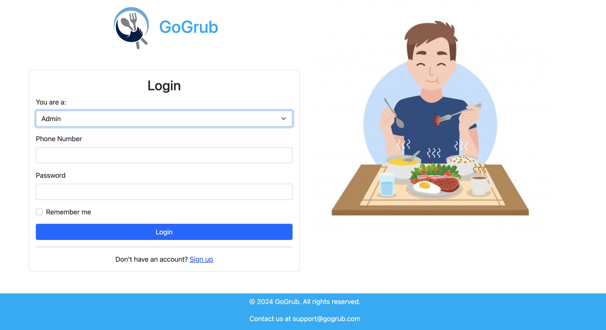
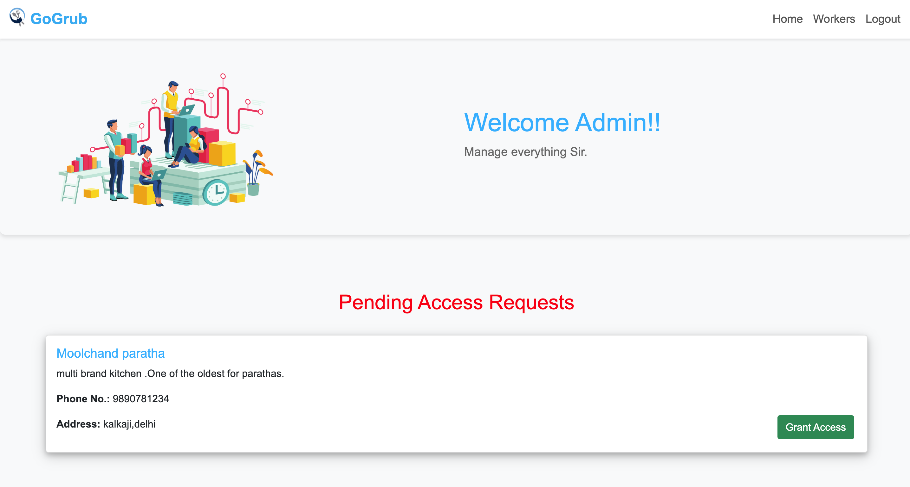
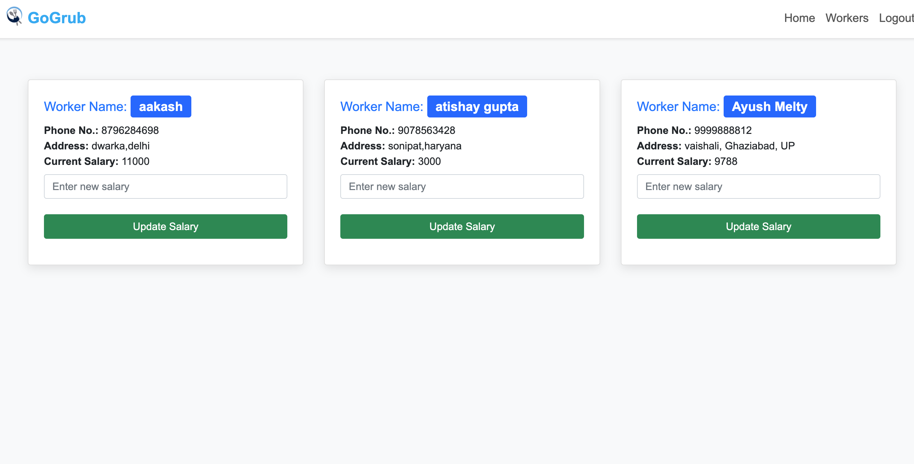
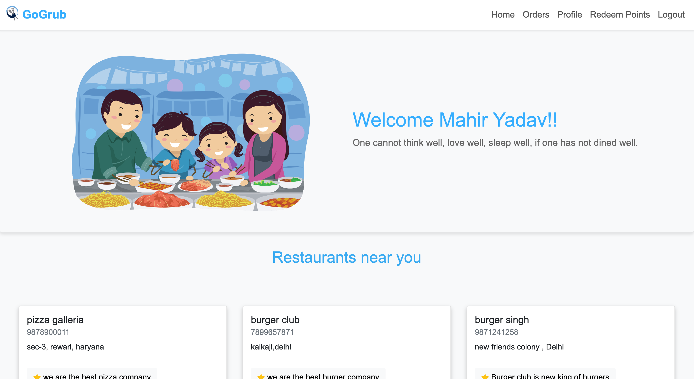
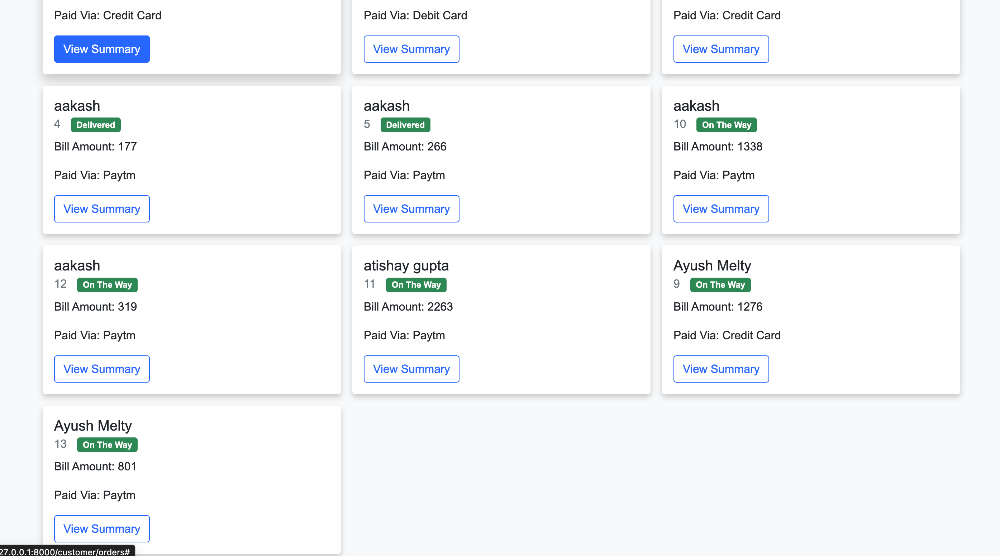
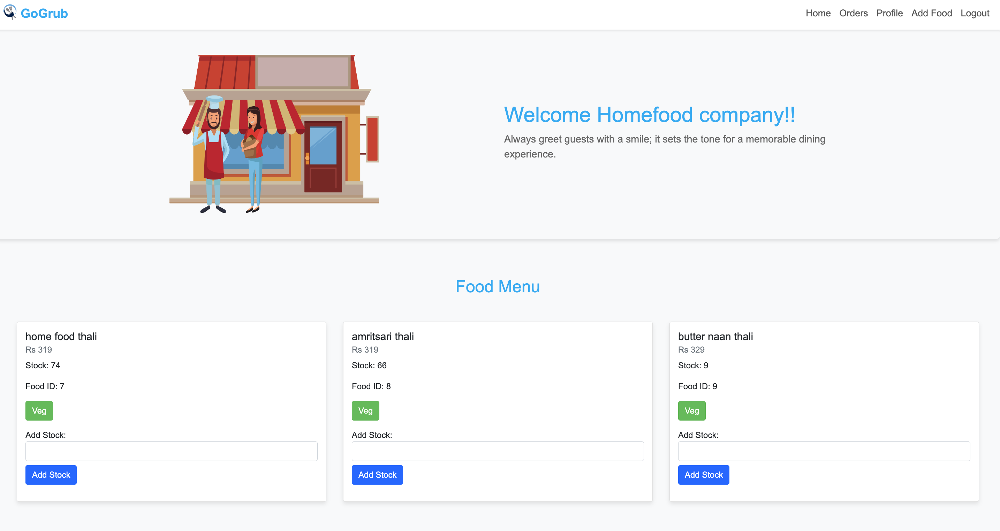
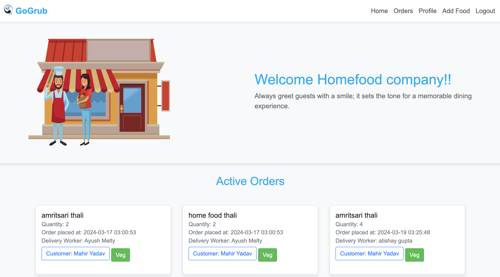
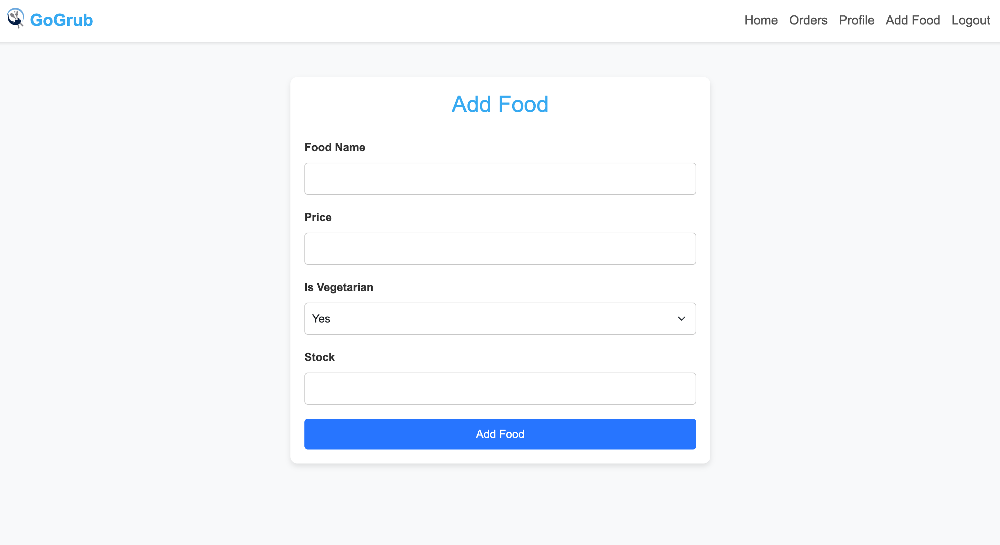
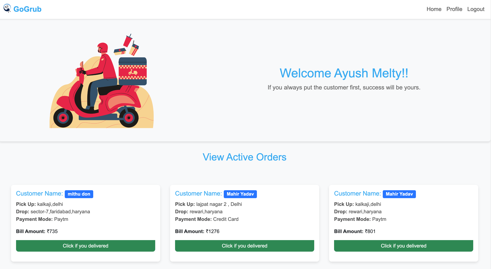

# GoGrub

## About the Project
GoGrub is a fast, reliable, and convenient way to deliver your favourite meals to your doorstep. It is an online food ordering platform that helps restaurants list food items and allows customers to browse and purchase them.

This project is part of the Database Management System course at IIIT-Delhi. **Mysql** has been used for storage, **flask** for the backend, and **HTML** and **CSS** have been used for the front end.
For knowing more go to **GoGrubReport.pdf**

## Setup

- Open your **Terminal / Cmd**
 ```
 git clone "https://github.com/mahir-yadav/GoGrub.git" 
 ```

#### Load MySQL data on your system

- Import the GoGrub database using the "GoGrubData" file.
- In MySQL workbench, use the **import data** option in **server tab**.
- Select **Import from self-contained file** and select the location of the **GoGrubData** file in the GoGrub repository.
- Make sure in GoGrub/app.py that you are using your own username and password to connect to MySQL.

#### Running the application 

- Open your **Terminal / Cmd**
 ```
 cd GoGrub
 pip install -r requirements.txt
 python app.py 
 ```

## Screenshots of the Application
**Login Page**
<h2 style="font-weight:bold;">Login Page</h2>
<p align ="center">
    
</p>
<h2 style="font-weight:bold;">Admin Home Page</h2>
<p align ="center">
    
</p>
<h2 style="font-weight:bold;">Admin can update salary of workers</h2>
<p align ="center">
    
</p>
<h2 style="font-weight:bold;">Customer Home Page</h2>

<p align ="center">
    
</p>

<h2 style="font-weight:bold;">Customer orders Page</h2>

<p align ="center">
    
</p>

<h2 style="font-weight:bold;">Restaurant Home Page and update stock</h2>

<p align ="center">
    
</p>
<h2 style="font-weight:bold;">Restaurant can see active orders</h2>

<p align ="center">
    
</p>

<h2 style="font-weight:bold;">Restaurant can add food too</h2>

<p align ="center">
    
</p>
<h2 style="font-weight:bold;">Delivery Worker home page can see his/her active orders and click "if delivered" if they delivered order.</h2>
<p align ="center">
    
</p>
